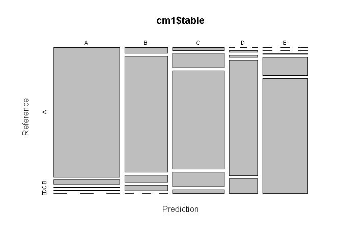
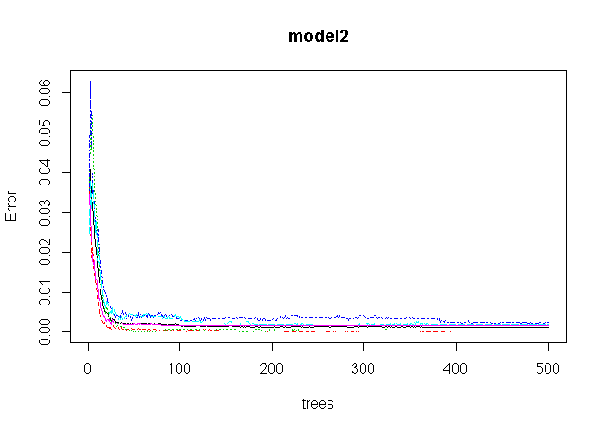

# Coursera Project on Practical Machine Learning
Adarsh Halan  
15 June 2017  


# Background

### Using devices such as Jawbone Up, Nike FuelBand, and Fitbit it is now possible to collect a large amount of data about personal activity relatively inexpensively. These type of devices are part of the quantified self movement - a group of enthusiasts who take measurements about themselves regularly to improve their health, to find patterns in their behavior, or because they are tech geeks. One thing that people regularly do is quantify how much of a particular activity they do, but they rarely quantify how well they do it. In this project, your goal will be to use data from accelerometers on the belt, forearm, arm, and dumbell of 6 participants. They were asked to perform barbell lifts correctly and incorrectly in 5 different ways. More information is available from the website here: http://groupware.les.inf.puc-rio.br/har (see the section on the Weight Lifting Exercise Dataset).

# Data

### The training data for this project are available here:

### https://d396qusza40orc.cloudfront.net/predmachlearn/pml-training.csv

### The test data are available here:

### https://d396qusza40orc.cloudfront.net/predmachlearn/pml-testing.csv

### The data for this project come from this source: http://groupware.les.inf.puc-rio.br/har. If you use the document you create for this class for any purpose please cite them as they have been very generous in allowing their data to be used for this kind of assignment.

# Project Goal

### The goal of your project is to predict the manner in which they did the exercise. This is the "classe" variable in the training set. You may use any of the other variables to predict with. You should create a report describing how you built your model, how you used cross validation, what you think the expected out of sample error is, and why you made the choices you did. You will also use your prediction model to predict 20 different test cases.

# Data Processing and Results 

### Loading required packages, setting seed and getting data:

```r
library(caret)
```

```
## Loading required package: lattice
```

```
## Loading required package: ggplot2
```

```r
library(rpart)
library(rpart.plot)
library(RColorBrewer)
library(rattle)
```

```
## Rattle: A free graphical interface for data mining with R.
## Version 4.1.0 Copyright (c) 2006-2015 Togaware Pty Ltd.
## Type 'rattle()' to shake, rattle, and roll your data.
```

```r
library(randomForest)
```

```
## randomForest 4.6-12
```

```
## Type rfNews() to see new features/changes/bug fixes.
```

```
## 
## Attaching package: 'randomForest'
```

```
## The following object is masked from 'package:ggplot2':
## 
##     margin
```

```r
library(knitr)
set.seed(88888)

trainUrl <- "http://d396qusza40orc.cloudfront.net/predmachlearn/pml-training.csv"
testUrl <- "http://d396qusza40orc.cloudfront.net/predmachlearn/pml-testing.csv"

training <- read.csv(url(trainUrl), na.strings=c("NA","#DIV/0!",""), header = TRUE)
testing <- read.csv(url(testUrl), na.strings=c("NA","#DIV/0!",""), header = TRUE)
```

```r
dim(training)
```

```
## [1] 19622   160
```

```r
dim(testing)
```

```
## [1]  20 160
```

### The training dataset has 19622 observations and 160 variables, and the testing data set contains 20 observations and the same variables as the training set. We are trying to predict the outcome of the variable classe in the training set.


```r
head(training)
```

```
##   X user_name raw_timestamp_part_1 raw_timestamp_part_2   cvtd_timestamp
## 1 1  carlitos           1323084231               788290 05/12/2011 11:23
## 2 2  carlitos           1323084231               808298 05/12/2011 11:23
## 3 3  carlitos           1323084231               820366 05/12/2011 11:23
## 4 4  carlitos           1323084232               120339 05/12/2011 11:23
## 5 5  carlitos           1323084232               196328 05/12/2011 11:23
## 6 6  carlitos           1323084232               304277 05/12/2011 11:23
##   new_window num_window roll_belt pitch_belt yaw_belt total_accel_belt
## 1         no         11      1.41       8.07    -94.4                3
## 2         no         11      1.41       8.07    -94.4                3
## 3         no         11      1.42       8.07    -94.4                3
## 4         no         12      1.48       8.05    -94.4                3
## 5         no         12      1.48       8.07    -94.4                3
## 6         no         12      1.45       8.06    -94.4                3
##   kurtosis_roll_belt kurtosis_picth_belt kurtosis_yaw_belt
## 1                 NA                  NA                NA
## 2                 NA                  NA                NA
## 3                 NA                  NA                NA
## 4                 NA                  NA                NA
## 5                 NA                  NA                NA
## 6                 NA                  NA                NA
##   skewness_roll_belt skewness_roll_belt.1 skewness_yaw_belt max_roll_belt
## 1                 NA                   NA                NA            NA
## 2                 NA                   NA                NA            NA
## 3                 NA                   NA                NA            NA
## 4                 NA                   NA                NA            NA
## 5                 NA                   NA                NA            NA
## 6                 NA                   NA                NA            NA
##   max_picth_belt max_yaw_belt min_roll_belt min_pitch_belt min_yaw_belt
## 1             NA           NA            NA             NA           NA
## 2             NA           NA            NA             NA           NA
## 3             NA           NA            NA             NA           NA
## 4             NA           NA            NA             NA           NA
## 5             NA           NA            NA             NA           NA
## 6             NA           NA            NA             NA           NA
##   amplitude_roll_belt amplitude_pitch_belt amplitude_yaw_belt
## 1                  NA                   NA                 NA
## 2                  NA                   NA                 NA
## 3                  NA                   NA                 NA
## 4                  NA                   NA                 NA
## 5                  NA                   NA                 NA
## 6                  NA                   NA                 NA
##   var_total_accel_belt avg_roll_belt stddev_roll_belt var_roll_belt
## 1                   NA            NA               NA            NA
## 2                   NA            NA               NA            NA
## 3                   NA            NA               NA            NA
## 4                   NA            NA               NA            NA
## 5                   NA            NA               NA            NA
## 6                   NA            NA               NA            NA
##   avg_pitch_belt stddev_pitch_belt var_pitch_belt avg_yaw_belt
## 1             NA                NA             NA           NA
## 2             NA                NA             NA           NA
## 3             NA                NA             NA           NA
## 4             NA                NA             NA           NA
## 5             NA                NA             NA           NA
## 6             NA                NA             NA           NA
##   stddev_yaw_belt var_yaw_belt gyros_belt_x gyros_belt_y gyros_belt_z
## 1              NA           NA         0.00         0.00        -0.02
## 2              NA           NA         0.02         0.00        -0.02
## 3              NA           NA         0.00         0.00        -0.02
## 4              NA           NA         0.02         0.00        -0.03
## 5              NA           NA         0.02         0.02        -0.02
## 6              NA           NA         0.02         0.00        -0.02
##   accel_belt_x accel_belt_y accel_belt_z magnet_belt_x magnet_belt_y
## 1          -21            4           22            -3           599
## 2          -22            4           22            -7           608
## 3          -20            5           23            -2           600
## 4          -22            3           21            -6           604
## 5          -21            2           24            -6           600
## 6          -21            4           21             0           603
##   magnet_belt_z roll_arm pitch_arm yaw_arm total_accel_arm var_accel_arm
## 1          -313     -128      22.5    -161              34            NA
## 2          -311     -128      22.5    -161              34            NA
## 3          -305     -128      22.5    -161              34            NA
## 4          -310     -128      22.1    -161              34            NA
## 5          -302     -128      22.1    -161              34            NA
## 6          -312     -128      22.0    -161              34            NA
##   avg_roll_arm stddev_roll_arm var_roll_arm avg_pitch_arm stddev_pitch_arm
## 1           NA              NA           NA            NA               NA
## 2           NA              NA           NA            NA               NA
## 3           NA              NA           NA            NA               NA
## 4           NA              NA           NA            NA               NA
## 5           NA              NA           NA            NA               NA
## 6           NA              NA           NA            NA               NA
##   var_pitch_arm avg_yaw_arm stddev_yaw_arm var_yaw_arm gyros_arm_x
## 1            NA          NA             NA          NA        0.00
## 2            NA          NA             NA          NA        0.02
## 3            NA          NA             NA          NA        0.02
## 4            NA          NA             NA          NA        0.02
## 5            NA          NA             NA          NA        0.00
## 6            NA          NA             NA          NA        0.02
##   gyros_arm_y gyros_arm_z accel_arm_x accel_arm_y accel_arm_z magnet_arm_x
## 1        0.00       -0.02        -288         109        -123         -368
## 2       -0.02       -0.02        -290         110        -125         -369
## 3       -0.02       -0.02        -289         110        -126         -368
## 4       -0.03        0.02        -289         111        -123         -372
## 5       -0.03        0.00        -289         111        -123         -374
## 6       -0.03        0.00        -289         111        -122         -369
##   magnet_arm_y magnet_arm_z kurtosis_roll_arm kurtosis_picth_arm
## 1          337          516                NA                 NA
## 2          337          513                NA                 NA
## 3          344          513                NA                 NA
## 4          344          512                NA                 NA
## 5          337          506                NA                 NA
## 6          342          513                NA                 NA
##   kurtosis_yaw_arm skewness_roll_arm skewness_pitch_arm skewness_yaw_arm
## 1               NA                NA                 NA               NA
## 2               NA                NA                 NA               NA
## 3               NA                NA                 NA               NA
## 4               NA                NA                 NA               NA
## 5               NA                NA                 NA               NA
## 6               NA                NA                 NA               NA
##   max_roll_arm max_picth_arm max_yaw_arm min_roll_arm min_pitch_arm
## 1           NA            NA          NA           NA            NA
## 2           NA            NA          NA           NA            NA
## 3           NA            NA          NA           NA            NA
## 4           NA            NA          NA           NA            NA
## 5           NA            NA          NA           NA            NA
## 6           NA            NA          NA           NA            NA
##   min_yaw_arm amplitude_roll_arm amplitude_pitch_arm amplitude_yaw_arm
## 1          NA                 NA                  NA                NA
## 2          NA                 NA                  NA                NA
## 3          NA                 NA                  NA                NA
## 4          NA                 NA                  NA                NA
## 5          NA                 NA                  NA                NA
## 6          NA                 NA                  NA                NA
##   roll_dumbbell pitch_dumbbell yaw_dumbbell kurtosis_roll_dumbbell
## 1      13.05217      -70.49400    -84.87394                     NA
## 2      13.13074      -70.63751    -84.71065                     NA
## 3      12.85075      -70.27812    -85.14078                     NA
## 4      13.43120      -70.39379    -84.87363                     NA
## 5      13.37872      -70.42856    -84.85306                     NA
## 6      13.38246      -70.81759    -84.46500                     NA
##   kurtosis_picth_dumbbell kurtosis_yaw_dumbbell skewness_roll_dumbbell
## 1                      NA                    NA                     NA
## 2                      NA                    NA                     NA
## 3                      NA                    NA                     NA
## 4                      NA                    NA                     NA
## 5                      NA                    NA                     NA
## 6                      NA                    NA                     NA
##   skewness_pitch_dumbbell skewness_yaw_dumbbell max_roll_dumbbell
## 1                      NA                    NA                NA
## 2                      NA                    NA                NA
## 3                      NA                    NA                NA
## 4                      NA                    NA                NA
## 5                      NA                    NA                NA
## 6                      NA                    NA                NA
##   max_picth_dumbbell max_yaw_dumbbell min_roll_dumbbell min_pitch_dumbbell
## 1                 NA               NA                NA                 NA
## 2                 NA               NA                NA                 NA
## 3                 NA               NA                NA                 NA
## 4                 NA               NA                NA                 NA
## 5                 NA               NA                NA                 NA
## 6                 NA               NA                NA                 NA
##   min_yaw_dumbbell amplitude_roll_dumbbell amplitude_pitch_dumbbell
## 1               NA                      NA                       NA
## 2               NA                      NA                       NA
## 3               NA                      NA                       NA
## 4               NA                      NA                       NA
## 5               NA                      NA                       NA
## 6               NA                      NA                       NA
##   amplitude_yaw_dumbbell total_accel_dumbbell var_accel_dumbbell
## 1                     NA                   37                 NA
## 2                     NA                   37                 NA
## 3                     NA                   37                 NA
## 4                     NA                   37                 NA
## 5                     NA                   37                 NA
## 6                     NA                   37                 NA
##   avg_roll_dumbbell stddev_roll_dumbbell var_roll_dumbbell
## 1                NA                   NA                NA
## 2                NA                   NA                NA
## 3                NA                   NA                NA
## 4                NA                   NA                NA
## 5                NA                   NA                NA
## 6                NA                   NA                NA
##   avg_pitch_dumbbell stddev_pitch_dumbbell var_pitch_dumbbell
## 1                 NA                    NA                 NA
## 2                 NA                    NA                 NA
## 3                 NA                    NA                 NA
## 4                 NA                    NA                 NA
## 5                 NA                    NA                 NA
## 6                 NA                    NA                 NA
##   avg_yaw_dumbbell stddev_yaw_dumbbell var_yaw_dumbbell gyros_dumbbell_x
## 1               NA                  NA               NA                0
## 2               NA                  NA               NA                0
## 3               NA                  NA               NA                0
## 4               NA                  NA               NA                0
## 5               NA                  NA               NA                0
## 6               NA                  NA               NA                0
##   gyros_dumbbell_y gyros_dumbbell_z accel_dumbbell_x accel_dumbbell_y
## 1            -0.02             0.00             -234               47
## 2            -0.02             0.00             -233               47
## 3            -0.02             0.00             -232               46
## 4            -0.02            -0.02             -232               48
## 5            -0.02             0.00             -233               48
## 6            -0.02             0.00             -234               48
##   accel_dumbbell_z magnet_dumbbell_x magnet_dumbbell_y magnet_dumbbell_z
## 1             -271              -559               293               -65
## 2             -269              -555               296               -64
## 3             -270              -561               298               -63
## 4             -269              -552               303               -60
## 5             -270              -554               292               -68
## 6             -269              -558               294               -66
##   roll_forearm pitch_forearm yaw_forearm kurtosis_roll_forearm
## 1         28.4         -63.9        -153                    NA
## 2         28.3         -63.9        -153                    NA
## 3         28.3         -63.9        -152                    NA
## 4         28.1         -63.9        -152                    NA
## 5         28.0         -63.9        -152                    NA
## 6         27.9         -63.9        -152                    NA
##   kurtosis_picth_forearm kurtosis_yaw_forearm skewness_roll_forearm
## 1                     NA                   NA                    NA
## 2                     NA                   NA                    NA
## 3                     NA                   NA                    NA
## 4                     NA                   NA                    NA
## 5                     NA                   NA                    NA
## 6                     NA                   NA                    NA
##   skewness_pitch_forearm skewness_yaw_forearm max_roll_forearm
## 1                     NA                   NA               NA
## 2                     NA                   NA               NA
## 3                     NA                   NA               NA
## 4                     NA                   NA               NA
## 5                     NA                   NA               NA
## 6                     NA                   NA               NA
##   max_picth_forearm max_yaw_forearm min_roll_forearm min_pitch_forearm
## 1                NA              NA               NA                NA
## 2                NA              NA               NA                NA
## 3                NA              NA               NA                NA
## 4                NA              NA               NA                NA
## 5                NA              NA               NA                NA
## 6                NA              NA               NA                NA
##   min_yaw_forearm amplitude_roll_forearm amplitude_pitch_forearm
## 1              NA                     NA                      NA
## 2              NA                     NA                      NA
## 3              NA                     NA                      NA
## 4              NA                     NA                      NA
## 5              NA                     NA                      NA
## 6              NA                     NA                      NA
##   amplitude_yaw_forearm total_accel_forearm var_accel_forearm
## 1                    NA                  36                NA
## 2                    NA                  36                NA
## 3                    NA                  36                NA
## 4                    NA                  36                NA
## 5                    NA                  36                NA
## 6                    NA                  36                NA
##   avg_roll_forearm stddev_roll_forearm var_roll_forearm avg_pitch_forearm
## 1               NA                  NA               NA                NA
## 2               NA                  NA               NA                NA
## 3               NA                  NA               NA                NA
## 4               NA                  NA               NA                NA
## 5               NA                  NA               NA                NA
## 6               NA                  NA               NA                NA
##   stddev_pitch_forearm var_pitch_forearm avg_yaw_forearm
## 1                   NA                NA              NA
## 2                   NA                NA              NA
## 3                   NA                NA              NA
## 4                   NA                NA              NA
## 5                   NA                NA              NA
## 6                   NA                NA              NA
##   stddev_yaw_forearm var_yaw_forearm gyros_forearm_x gyros_forearm_y
## 1                 NA              NA            0.03            0.00
## 2                 NA              NA            0.02            0.00
## 3                 NA              NA            0.03           -0.02
## 4                 NA              NA            0.02           -0.02
## 5                 NA              NA            0.02            0.00
## 6                 NA              NA            0.02           -0.02
##   gyros_forearm_z accel_forearm_x accel_forearm_y accel_forearm_z
## 1           -0.02             192             203            -215
## 2           -0.02             192             203            -216
## 3            0.00             196             204            -213
## 4            0.00             189             206            -214
## 5           -0.02             189             206            -214
## 6           -0.03             193             203            -215
##   magnet_forearm_x magnet_forearm_y magnet_forearm_z classe
## 1              -17              654              476      A
## 2              -18              661              473      A
## 3              -18              658              469      A
## 4              -16              658              469      A
## 5              -17              655              473      A
## 6               -9              660              478      A
```

We see a lot of NA variables, hence we remove them : (cleaning data)


```r
training <- training[, colSums(is.na(training)) == 0]
testing <- testing[, colSums(is.na(testing)) == 0]
dim(training); head(training)
```

```
## [1] 19622    60
```

```
##   X user_name raw_timestamp_part_1 raw_timestamp_part_2   cvtd_timestamp
## 1 1  carlitos           1323084231               788290 05/12/2011 11:23
## 2 2  carlitos           1323084231               808298 05/12/2011 11:23
## 3 3  carlitos           1323084231               820366 05/12/2011 11:23
## 4 4  carlitos           1323084232               120339 05/12/2011 11:23
## 5 5  carlitos           1323084232               196328 05/12/2011 11:23
## 6 6  carlitos           1323084232               304277 05/12/2011 11:23
##   new_window num_window roll_belt pitch_belt yaw_belt total_accel_belt
## 1         no         11      1.41       8.07    -94.4                3
## 2         no         11      1.41       8.07    -94.4                3
## 3         no         11      1.42       8.07    -94.4                3
## 4         no         12      1.48       8.05    -94.4                3
## 5         no         12      1.48       8.07    -94.4                3
## 6         no         12      1.45       8.06    -94.4                3
##   gyros_belt_x gyros_belt_y gyros_belt_z accel_belt_x accel_belt_y
## 1         0.00         0.00        -0.02          -21            4
## 2         0.02         0.00        -0.02          -22            4
## 3         0.00         0.00        -0.02          -20            5
## 4         0.02         0.00        -0.03          -22            3
## 5         0.02         0.02        -0.02          -21            2
## 6         0.02         0.00        -0.02          -21            4
##   accel_belt_z magnet_belt_x magnet_belt_y magnet_belt_z roll_arm
## 1           22            -3           599          -313     -128
## 2           22            -7           608          -311     -128
## 3           23            -2           600          -305     -128
## 4           21            -6           604          -310     -128
## 5           24            -6           600          -302     -128
## 6           21             0           603          -312     -128
##   pitch_arm yaw_arm total_accel_arm gyros_arm_x gyros_arm_y gyros_arm_z
## 1      22.5    -161              34        0.00        0.00       -0.02
## 2      22.5    -161              34        0.02       -0.02       -0.02
## 3      22.5    -161              34        0.02       -0.02       -0.02
## 4      22.1    -161              34        0.02       -0.03        0.02
## 5      22.1    -161              34        0.00       -0.03        0.00
## 6      22.0    -161              34        0.02       -0.03        0.00
##   accel_arm_x accel_arm_y accel_arm_z magnet_arm_x magnet_arm_y
## 1        -288         109        -123         -368          337
## 2        -290         110        -125         -369          337
## 3        -289         110        -126         -368          344
## 4        -289         111        -123         -372          344
## 5        -289         111        -123         -374          337
## 6        -289         111        -122         -369          342
##   magnet_arm_z roll_dumbbell pitch_dumbbell yaw_dumbbell
## 1          516      13.05217      -70.49400    -84.87394
## 2          513      13.13074      -70.63751    -84.71065
## 3          513      12.85075      -70.27812    -85.14078
## 4          512      13.43120      -70.39379    -84.87363
## 5          506      13.37872      -70.42856    -84.85306
## 6          513      13.38246      -70.81759    -84.46500
##   total_accel_dumbbell gyros_dumbbell_x gyros_dumbbell_y gyros_dumbbell_z
## 1                   37                0            -0.02             0.00
## 2                   37                0            -0.02             0.00
## 3                   37                0            -0.02             0.00
## 4                   37                0            -0.02            -0.02
## 5                   37                0            -0.02             0.00
## 6                   37                0            -0.02             0.00
##   accel_dumbbell_x accel_dumbbell_y accel_dumbbell_z magnet_dumbbell_x
## 1             -234               47             -271              -559
## 2             -233               47             -269              -555
## 3             -232               46             -270              -561
## 4             -232               48             -269              -552
## 5             -233               48             -270              -554
## 6             -234               48             -269              -558
##   magnet_dumbbell_y magnet_dumbbell_z roll_forearm pitch_forearm
## 1               293               -65         28.4         -63.9
## 2               296               -64         28.3         -63.9
## 3               298               -63         28.3         -63.9
## 4               303               -60         28.1         -63.9
## 5               292               -68         28.0         -63.9
## 6               294               -66         27.9         -63.9
##   yaw_forearm total_accel_forearm gyros_forearm_x gyros_forearm_y
## 1        -153                  36            0.03            0.00
## 2        -153                  36            0.02            0.00
## 3        -152                  36            0.03           -0.02
## 4        -152                  36            0.02           -0.02
## 5        -152                  36            0.02            0.00
## 6        -152                  36            0.02           -0.02
##   gyros_forearm_z accel_forearm_x accel_forearm_y accel_forearm_z
## 1           -0.02             192             203            -215
## 2           -0.02             192             203            -216
## 3            0.00             196             204            -213
## 4            0.00             189             206            -214
## 5           -0.02             189             206            -214
## 6           -0.03             193             203            -215
##   magnet_forearm_x magnet_forearm_y magnet_forearm_z classe
## 1              -17              654              476      A
## 2              -18              661              473      A
## 3              -18              658              469      A
## 4              -16              658              469      A
## 5              -17              655              473      A
## 6               -9              660              478      A
```

```r
dim(testing); head(testing)
```

```
## [1] 20 60
```

```
##   X user_name raw_timestamp_part_1 raw_timestamp_part_2   cvtd_timestamp
## 1 1     pedro           1323095002               868349 05/12/2011 14:23
## 2 2    jeremy           1322673067               778725 30/11/2011 17:11
## 3 3    jeremy           1322673075               342967 30/11/2011 17:11
## 4 4    adelmo           1322832789               560311 02/12/2011 13:33
## 5 5    eurico           1322489635               814776 28/11/2011 14:13
## 6 6    jeremy           1322673149               510661 30/11/2011 17:12
##   new_window num_window roll_belt pitch_belt yaw_belt total_accel_belt
## 1         no         74    123.00      27.00    -4.75               20
## 2         no        431      1.02       4.87   -88.90                4
## 3         no        439      0.87       1.82   -88.50                5
## 4         no        194    125.00     -41.60   162.00               17
## 5         no        235      1.35       3.33   -88.60                3
## 6         no        504     -5.92       1.59   -87.70                4
##   gyros_belt_x gyros_belt_y gyros_belt_z accel_belt_x accel_belt_y
## 1        -0.50        -0.02        -0.46          -38           69
## 2        -0.06        -0.02        -0.07          -13           11
## 3         0.05         0.02         0.03            1           -1
## 4         0.11         0.11        -0.16           46           45
## 5         0.03         0.02         0.00           -8            4
## 6         0.10         0.05        -0.13          -11          -16
##   accel_belt_z magnet_belt_x magnet_belt_y magnet_belt_z roll_arm
## 1         -179           -13           581          -382     40.7
## 2           39            43           636          -309      0.0
## 3           49            29           631          -312      0.0
## 4         -156           169           608          -304   -109.0
## 5           27            33           566          -418     76.1
## 6           38            31           638          -291      0.0
##   pitch_arm yaw_arm total_accel_arm gyros_arm_x gyros_arm_y gyros_arm_z
## 1    -27.80     178              10       -1.65        0.48       -0.18
## 2      0.00       0              38       -1.17        0.85       -0.43
## 3      0.00       0              44        2.10       -1.36        1.13
## 4     55.00    -142              25        0.22       -0.51        0.92
## 5      2.76     102              29       -1.96        0.79       -0.54
## 6      0.00       0              14        0.02        0.05       -0.07
##   accel_arm_x accel_arm_y accel_arm_z magnet_arm_x magnet_arm_y
## 1          16          38          93         -326          385
## 2        -290         215         -90         -325          447
## 3        -341         245         -87         -264          474
## 4        -238         -57           6         -173          257
## 5        -197         200         -30         -170          275
## 6         -26         130         -19          396          176
##   magnet_arm_z roll_dumbbell pitch_dumbbell yaw_dumbbell
## 1          481     -17.73748       24.96085    126.23596
## 2          434      54.47761      -53.69758    -75.51480
## 3          413      57.07031      -51.37303    -75.20287
## 4          633      43.10927      -30.04885   -103.32003
## 5          617    -101.38396      -53.43952    -14.19542
## 6          516      62.18750      -50.55595    -71.12063
##   total_accel_dumbbell gyros_dumbbell_x gyros_dumbbell_y gyros_dumbbell_z
## 1                    9             0.64             0.06            -0.61
## 2                   31             0.34             0.05            -0.71
## 3                   29             0.39             0.14            -0.34
## 4                   18             0.10            -0.02             0.05
## 5                    4             0.29            -0.47            -0.46
## 6                   29            -0.59             0.80             1.10
##   accel_dumbbell_x accel_dumbbell_y accel_dumbbell_z magnet_dumbbell_x
## 1               21              -15               81               523
## 2             -153              155             -205              -502
## 3             -141              155             -196              -506
## 4              -51               72             -148              -576
## 5              -18              -30               -5              -424
## 6             -138              166             -186              -543
##   magnet_dumbbell_y magnet_dumbbell_z roll_forearm pitch_forearm
## 1              -528               -56          141         49.30
## 2               388               -36          109        -17.60
## 3               349                41          131        -32.60
## 4               238                53            0          0.00
## 5               252               312         -176         -2.16
## 6               262                96          150          1.46
##   yaw_forearm total_accel_forearm gyros_forearm_x gyros_forearm_y
## 1       156.0                  33            0.74           -3.34
## 2       106.0                  39            1.12           -2.78
## 3        93.0                  34            0.18           -0.79
## 4         0.0                  43            1.38            0.69
## 5       -47.9                  24           -0.75            3.10
## 6        89.7                  43           -0.88            4.26
##   gyros_forearm_z accel_forearm_x accel_forearm_y accel_forearm_z
## 1           -0.59            -110             267            -149
## 2           -0.18             212             297            -118
## 3            0.28             154             271            -129
## 4            1.80             -92             406             -39
## 5            0.80             131             -93             172
## 6            1.35             230             322            -144
##   magnet_forearm_x magnet_forearm_y magnet_forearm_z problem_id
## 1             -714              419              617          1
## 2             -237              791              873          2
## 3              -51              698              783          3
## 4             -233              783              521          4
## 5              375             -787               91          5
## 6             -300              800              884          6
```

```r
# data still has a lot of zero variance entries, remove zero vairance entries
nzv <- nearZeroVar(training, saveMetrics=TRUE)
training <- training[,nzv$nzv==FALSE]

nzv <- nearZeroVar(testing, saveMetrics = TRUE)
testing <- testing[,nzv$nzv == FALSE]

# remove 1st column of training data set
training <- training[c(-1)]
```


### Split Training data into train and test sets for getting out-of-sample errors, predication and testing validtion thereof. 


```r
inTrain <- createDataPartition(training$classe, p = 0.7, list = FALSE)
train <- training[inTrain, ]
test <- training[-inTrain, ]

c1 <- colnames(train)
c2 <- colnames(train[, -58]) # classe column removed
test <- test[c1]
testing <- testing[c2]
```

### convert data into same type.


```r
for (i in 1:length(testing) ) {
    for(j in 1:length(train)) {
        if( length( grep(names(train[i]), names(testing)[j]) ) ==1)  {
            class(testing[j]) <- class(train[i])
        }      
    }      
}
testing <- rbind(train[2, -58] , testing) 
testing <- testing[-1,]
dim(test) ; dim(testing)
```

```
## [1] 5885   58
```

```
## [1] 20 57
```


## Define model and predict outcome 

### Using Classification Trees: We first use the R function rpart to define our model with method "class"


```r
model <- rpart(classe ~ ., data=train, method="class")
fancyRpartPlot(model)
```

<!-- -->

### Prediction and confusion matrix 


```r
#prediction on test data
pred1 <- predict(model, test, type = "class")
# confusion matrix
cm1 <- confusionMatrix(pred1, test$classe)
cm1
```

```
## Confusion Matrix and Statistics
## 
##           Reference
## Prediction    A    B    C    D    E
##          A 1605   55    6    1    0
##          B   44  935   57   44    0
##          C   25  140  948  143   38
##          D    0    9   11  622   81
##          E    0    0    4  154  963
## 
## Overall Statistics
##                                           
##                Accuracy : 0.862           
##                  95% CI : (0.8529, 0.8707)
##     No Information Rate : 0.2845          
##     P-Value [Acc > NIR] : < 2.2e-16       
##                                           
##                   Kappa : 0.8254          
##  Mcnemar's Test P-Value : NA              
## 
## Statistics by Class:
## 
##                      Class: A Class: B Class: C Class: D Class: E
## Sensitivity            0.9588   0.8209   0.9240   0.6452   0.8900
## Specificity            0.9853   0.9694   0.9288   0.9795   0.9671
## Pos Pred Value         0.9628   0.8657   0.7326   0.8603   0.8591
## Neg Pred Value         0.9836   0.9575   0.9830   0.9337   0.9750
## Prevalence             0.2845   0.1935   0.1743   0.1638   0.1839
## Detection Rate         0.2727   0.1589   0.1611   0.1057   0.1636
## Detection Prevalence   0.2833   0.1835   0.2199   0.1229   0.1905
## Balanced Accuracy      0.9720   0.8952   0.9264   0.8124   0.9286
```

```r
plot(cm1$table)
```

<!-- -->

#### we are getting a 86.2 % accuracy rate. There must be something missing in our above model. Lets try again with another method .

## Using Random Forest Method - Prediction and confusion matrix 

### The random forest model naturally provides cross validation, the technique of continuing to repartition the data again and again to make sure the break up of data does not erroneously affect the outcome. In the random forest model, hundreds of decision trees are created, broken up in different ways and on different variables, then the results averaged to provide the best accuracy. This explains why the model is both accurate and time consuming.


```r
# using random forest method
model2 <- randomForest(classe ~ ., data=train)
model2 
```

```
## 
## Call:
##  randomForest(formula = classe ~ ., data = train) 
##                Type of random forest: classification
##                      Number of trees: 500
## No. of variables tried at each split: 7
## 
##         OOB estimate of  error rate: 0.12%
## Confusion matrix:
##      A    B    C    D    E  class.error
## A 3905    1    0    0    0 0.0002560164
## B    1 2657    0    0    0 0.0003762227
## C    0    4 2390    2    0 0.0025041736
## D    0    0    1 2248    3 0.0017761989
## E    0    0    0    4 2521 0.0015841584
```

```r
pred2 <- predict(model2, test, type = "class")
cm2 <- confusionMatrix(pred2, test$classe)
cm2
```

```
## Confusion Matrix and Statistics
## 
##           Reference
## Prediction    A    B    C    D    E
##          A 1674    1    0    0    0
##          B    0 1138    1    0    0
##          C    0    0 1024    0    0
##          D    0    0    1  964    0
##          E    0    0    0    0 1082
## 
## Overall Statistics
##                                           
##                Accuracy : 0.9995          
##                  95% CI : (0.9985, 0.9999)
##     No Information Rate : 0.2845          
##     P-Value [Acc > NIR] : < 2.2e-16       
##                                           
##                   Kappa : 0.9994          
##  Mcnemar's Test P-Value : NA              
## 
## Statistics by Class:
## 
##                      Class: A Class: B Class: C Class: D Class: E
## Sensitivity            1.0000   0.9991   0.9981   1.0000   1.0000
## Specificity            0.9998   0.9998   1.0000   0.9998   1.0000
## Pos Pred Value         0.9994   0.9991   1.0000   0.9990   1.0000
## Neg Pred Value         1.0000   0.9998   0.9996   1.0000   1.0000
## Prevalence             0.2845   0.1935   0.1743   0.1638   0.1839
## Detection Rate         0.2845   0.1934   0.1740   0.1638   0.1839
## Detection Prevalence   0.2846   0.1935   0.1740   0.1640   0.1839
## Balanced Accuracy      0.9999   0.9995   0.9990   0.9999   1.0000
```

```r
plot(model2)
```

<!-- -->


### Random forest split data into 500 trees and 7 variables were tried at each split. We see that the accuracy is 99.95 % i.e. out ofsample error is 0.05% and Pvalue nearly zero. We also see that the random forest is a better model than Clasiification Trees model. 

### Lets predict the outcome on the testing set (given data) using the above model(Random Forest)


```r
final <- predict(model2, testing, type = "class")
final
```

```
##  1  2  3  4 51  6  7  8  9 10 11 12 13 14 15 16 17 18 19 20 
##  B  A  B  A  A  E  D  B  A  A  B  C  B  A  E  E  A  B  B  B 
## Levels: A B C D E
```

## We have successfully predicted the outcome of the test data using random forest model used on training data with 99.95% accuracy. 

### This concludes our Practical Machine Learning Project
